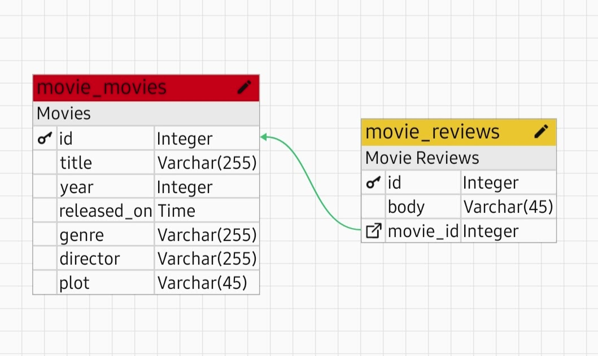
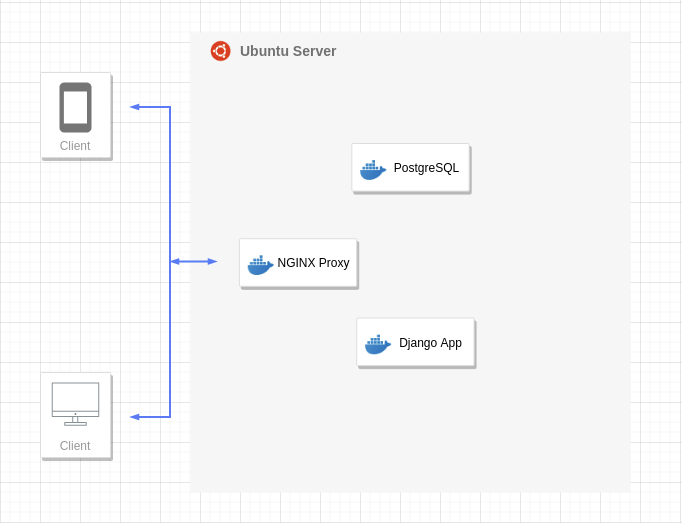

# Clockwork

<b>Clockwork</b> is a simple REST API built with Django, PostgreSQL and Nginx that serves filmographic and user review data. 

It supports X-Api-Key as means of authorization. Each key must be provided by the API's administrator in order to have full access to all endpoints.

## Database ERD
 

 

## Architecture
 

## Live Demo

### Admin Page
http://66.175.217.118:8080/admin

### Movies Endpoint
http://66.175.217.118:8080/movies

## Setup

Locally, it only uses two services. One for Postgres and another service for the Django application.

The live version uses a third service to run NGINX as layer 4 reverse proxy and to serve static files.

To run the development Docker containers run:

`docker-compose up --build`

OR 

`sudo docker-compose up --build`

## Acknowledgements

- [NicaSource](https://nicasource.com/)
- [Django REST Framework](https://www.django-rest-framework.org/)
- [Django REST Framework API Key](https://florimondmanca.github.io/djangorestframework-api-key/guide/)
- [Linode](https://www.linode.com/)
- [My brain](https://josias-alvarado.me)

